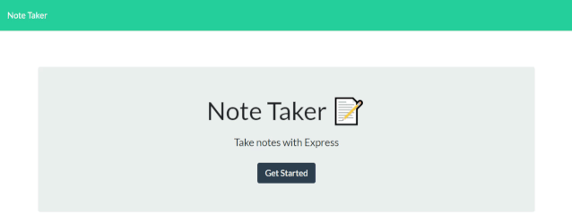
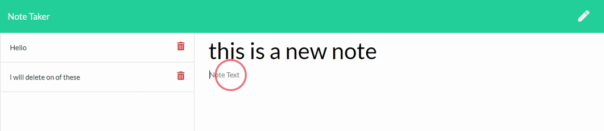

# [Highend Sticknote](https://highendstickynote.herokuapp.com)

Welcome to Highend stickynote, an online note taking system where you may add notes to remind you throughout the day what needs to be done.

You may add notes, check back on notes, and remove notes from Highend stickynote.

## Languages :
The live site is hosted on Heroku!

Front end was coded in HTML/CSS/Javascript & jQuery.

Backend was Node.js & Express.js.

Everything you do will be updated in real time including deleting notes!

You can see an example of deleting notes in real time with the following gif.

## Installation / Setup.

if you wish to run something like this yourself feel free to look over the code or clone the repository.

don't forget to `npm install` to get express.js

## Contact
Contact [Drkeck](https://www.github.com/drkeck) if you have any questions,

or you can contact me by [Email.](k3ck3ly.a@gmail.com)
